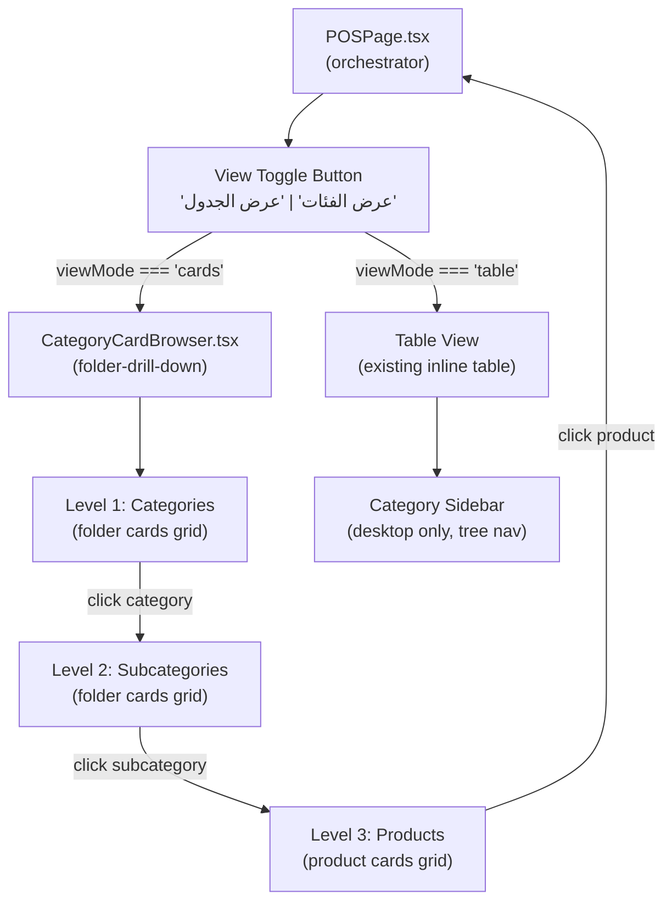
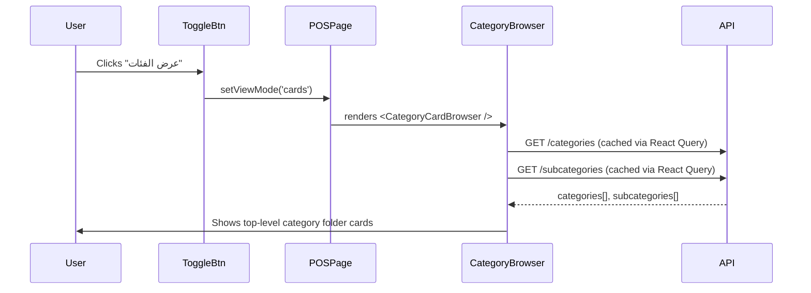
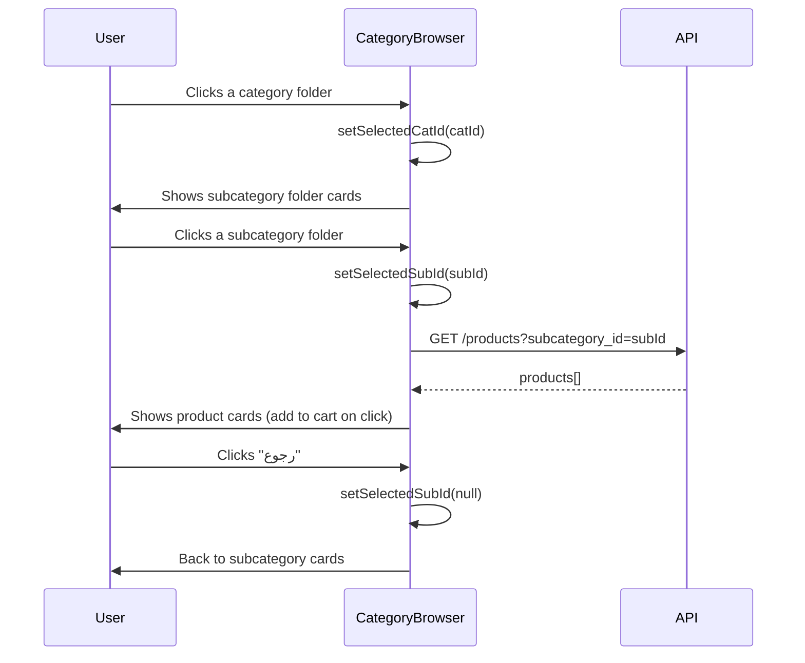

# Design Document: cashier-product-view

## Overview

The cashier POS interface needs two explicit product-browsing modes: a **Table View** (default, flat list) and a **Category/Folder View** (drill-down navigation through categories → subcategories → products). A clearly labeled toggle button in the search bar switches between the two modes. The feature is purely frontend — no backend changes are required because all needed API endpoints already exist (`/categories`, `/subcategories`, `/products`).

The existing codebase already has both a table view and a `CategoryCardBrowser` component that implements folder-drill-down. The primary work is:
1. Making the toggle button semantically clear (label "عرض الفئات" / "عرض الجدول" with descriptive icons instead of unlabeled icon-only).
2. Verifying the `CategoryCardBrowser` drill-down behavior matches the spec exactly.
3. Ensuring consistent behavior across both the desktop and mobile layouts.

---

## Architecture



---

## Sequence Diagrams

### Toggle: Table → Category View



### Category Drill-Down Flow



---

## Components and Interfaces

### 1. View Toggle Button (in `POSPage.tsx`)

**Purpose**: Switch between table view and category/folder view.

**Current state**: Icon-only button (`<LayoutGrid>` or `<List>`) with tooltip title only.

**Updated interface**:
```typescript
// viewMode state: 'table' | 'cards'
// Toggle handler already exists: setViewMode(viewMode === 'table' ? 'cards' : 'table')

// Desktop toggle button — updated to show label text
<button
  onClick={() => setViewMode(viewMode === 'table' ? 'cards' : 'table')}
  className="flex items-center gap-1.5 px-3 py-2 rounded-xl text-xs font-bold border border-slate-200 text-slate-500 hover:bg-slate-100 transition-colors flex-shrink-0"
>
  {viewMode === 'table'
    ? <><LayoutGrid size={14} /> عرض الفئات</>
    : <><List size={14} /> عرض الجدول</>
  }
</button>
```

**Responsibilities**:
- Shows current non-active mode as the button label (i.e., it says what you'll switch *to*)
- Both desktop and mobile layouts get the same labeled button
- Sidebar visibility: in table mode the left sidebar shows; in cards mode the sidebar is hidden (already implemented)

### 2. `CategoryCardBrowser.tsx` (folder-drill-down)

**Purpose**: Three-level drill-down: categories → subcategories → products.

**Interface (props)**:
```typescript
interface CategoryCardBrowserProps {
  warehouseId?: string      // for stock balance lookup
  mode: 'retail' | 'wholesale'  // determines which price to show
  onAddProduct: (product: any) => void  // callback to add to cart
}
```

**Internal state**:
```typescript
const [selectedCatId, setSelectedCatId] = useState<string | null>(null)
const [selectedSubId, setSelectedSubId] = useState<string | null>(null)
```

**Responsibilities**:
- Level 1 (no selection): renders all categories as colored folder cards in a responsive grid
- Level 2 (category selected): renders that category's subcategories as folder cards + breadcrumb + back button
- Level 3 (subcategory selected): renders products as clickable cards (with stock badge, price, name) + breadcrumb + back button
- Back button steps up one level: sub → cat → root
- Categories with zero subcategories jump directly to product list on click

**Note**: This component already exists and is correct. The main change is ensuring it is visible and labeled properly from the toggle button.

---

## Data Models

### ViewMode

```typescript
type ViewMode = 'table' | 'cards'
// Stored in POSPage local state: const [viewMode, setViewMode] = useState<ViewMode>('table')
// 'table' is the default — already correct
```

### Category (from API `/categories`)

```typescript
interface Category {
  id: string       // UUID
  name: string
}
```

### Subcategory (from API `/subcategories`)

```typescript
interface Subcategory {
  id: string       // UUID
  category_id: string
  name: string
}
```

### Product (from API `/products`)

```typescript
interface Product {
  id: string
  name: string
  retail_price: number
  wholesale_price: number
  cost_price: number
  company?: string
  shelf_number?: string
  stock_status: 'untracked' | 'tracked'
  subcategory_id: string
  unit: string
}
```

---

## Key Functions with Formal Specifications

### `handleCatClick(catId: string)`

**Location**: `CategoryCardBrowser.tsx`

**Preconditions**:
- `catId` is a valid UUID matching an entry in `categories`

**Postconditions**:
- `selectedCatId === catId`
- If the category has ≥ 1 subcategory: `selectedSubId === null` → renders subcategory grid
- If the category has 0 subcategories: `selectedSubId === '__all__'` → renders product grid (unfiltered for that category)

**Current implementation**:
```typescript
const handleCatClick = (catId: string) => {
  const subs = getSubsForCat(catId)
  setSelectedCatId(catId)
  if (subs.length === 0) setSelectedSubId('__all__')
  else setSelectedSubId(null)
}
```

### `handleBack()`

**Location**: `CategoryCardBrowser.tsx`

**Preconditions**:
- At least one of `selectedSubId` or `selectedCatId` is non-null

**Postconditions**:
- If `selectedSubId !== null`: `selectedSubId = null`, view returns to subcategory grid
- Else if `selectedCatId !== null`: `selectedCatId = null`, view returns to category grid

```typescript
const handleBack = () => {
  if (selectedSubId) { setSelectedSubId(null); return }
  if (selectedCatId) { setSelectedCatId(null); return }
}
```

**Loop Invariants**: N/A (no loops)

---

## Algorithmic Pseudocode

### View Render Decision

```pascal
ALGORITHM renderProductArea(viewMode)
INPUT: viewMode ∈ {'table', 'cards'}
OUTPUT: rendered UI component

BEGIN
  IF viewMode = 'cards' THEN
    RETURN <CategoryCardBrowser
              warehouseId=mainWh.id
              mode=mode
              onAddProduct=handleAddProduct />
  ELSE
    ASSERT viewMode = 'table'
    RETURN <CategorySidebar /> + <ProductTable />
  END IF
END
```

### Category Browser State Machine

```pascal
ALGORITHM renderCategoryBrowser(selectedCatId, selectedSubId)
INPUT: selectedCatId ∈ UUID | null, selectedSubId ∈ UUID | '__all__' | null
OUTPUT: rendered UI level

BEGIN
  IF selectedSubId ≠ null THEN
    // Level 3: Product cards
    products ← fetch('/products', subcategory_id=selectedSubId)
    RETURN <Breadcrumb/> + <BackBtn/> + <ProductGrid products=products/>
  
  ELSE IF selectedCatId ≠ null THEN
    // Level 2: Subcategory folder cards
    subs ← subcategories.filter(s → s.category_id = selectedCatId)
    RETURN <Breadcrumb/> + <BackBtn/> + <SubcategoryFolderGrid subs=subs/>
  
  ELSE
    // Level 1: Category folder cards
    RETURN <CategoryFolderGrid categories=categories/>
  END IF
END
```

---

## Example Usage

```typescript
// In POSPage.tsx — desktop layout, products area
{viewMode === 'cards' ? (
  <div className="flex-1 min-h-0">
    <CategoryCardBrowser
      warehouseId={mainWh?.id}
      mode={mode}
      onAddProduct={handleAddProduct}
    />
  </div>
) : (
  // table view JSX ...
)}

// Toggle button (updated)
<button
  onClick={() => setViewMode(viewMode === 'table' ? 'cards' : 'table')}
  className="flex items-center gap-1.5 px-3 py-2 rounded-xl text-xs font-bold border border-slate-200 text-slate-500 hover:bg-slate-100 transition-colors flex-shrink-0"
>
  {viewMode === 'table'
    ? <><LayoutGrid size={14} /> عرض الفئات</>
    : <><List size={14} /> عرض الجدول</>
  }
</button>
```

---

## Correctness Properties

*A property is a characteristic or behavior that should hold true across all valid executions of a system — essentially, a formal statement about what the system should do. Properties serve as the bridge between human-readable specifications and machine-verifiable correctness guarantees.*

### Property 1: Toggle Is an Involution

*For any* `viewMode` value in `{'table', 'cards'}`, toggling twice in succession returns `viewMode` to its original value: `toggle(toggle(v)) === v`.

**Validates: Requirements 2.3, 2.5**

---

### Property 2: Category Grid Renders All Categories

*For any* list of categories returned by the API, when `CategoryCardBrowser` is at the root level (no category selected), the number of folder cards rendered equals the number of categories in the dataset.

**Validates: Requirements 4.3**

---

### Property 3: Subcategory Drill-Down Shows Correct Children

*For any* category with at least one subcategory, when that category's folder card is clicked, the subcategory folder cards displayed are exactly the subcategories whose `category_id` matches the clicked category's `id` — no more, no fewer.

**Validates: Requirements 5.1**

---

### Property 4: Navigation Controls Present at Non-Root Levels

*For any* state where `selectedCatId` or `selectedSubId` is non-null (i.e., the browser is not at the top-level category grid), both the BreadcrumbNav and the BackButton SHALL be rendered in the `CategoryCardBrowser`.

**Validates: Requirements 5.2, 6.3**

---

### Property 5: Empty-Subcategory Category Jumps to Products

*For any* category whose subcategory count is zero, clicking its folder card transitions `CategoryCardBrowser` directly to the product level (setting `selectedSubId = '__all__'`) without passing through a subcategory grid.

**Validates: Requirements 5.3**

---

### Property 6: Product Cards Scoped to Selected Subcategory

*For any* subcategory folder card that is clicked, every product card rendered in the resulting product grid SHALL have `subcategory_id` equal to the clicked subcategory's `id`.

**Validates: Requirements 6.1**

---

### Property 7: Product Cards Contain Required Display Fields

*For any* product in the fetched product list, the rendered product card SHALL visibly contain the product's `name`, the correct price (based on the current `mode`), and a stock status indicator.

**Validates: Requirements 6.2, 9.1, 9.2**

---

### Property 8: onAddProduct Invoked with Correct Product

*For any* product `p` displayed in the `CategoryCardBrowser` product grid, clicking `p`'s card SHALL invoke the `onAddProduct` callback with exactly `p` as the argument.

**Validates: Requirements 6.4, 8.2**

---

### Property 9: Price Respects Sale Mode

*For any* product `p` and any sale `mode` value in `{'retail', 'wholesale'}`, the price displayed on `p`'s product card SHALL equal `p.retail_price` when `mode === 'retail'` and `p.wholesale_price` when `mode === 'wholesale'`.

**Validates: Requirements 9.1, 9.2**

---

### Property 10: Stock Filter Excludes Zero-Qty Tracked Products

*For any* list of products passed to either `CategoryCardBrowser` or `TableView`, no product whose `stock_status === 'tracked'` and available quantity ≤ 0 SHALL appear in the rendered output.

**Validates: Requirements 10.1, 10.2**

---

### Property 11: Back Navigation Clears Correct State Level

*For any* `CategoryCardBrowser` state where `selectedSubId` is non-null, pressing the BackButton SHALL set `selectedSubId` to `null` and leave `selectedCatId` unchanged. *For any* state where `selectedCatId` is non-null and `selectedSubId` is null, pressing the BackButton SHALL set `selectedCatId` to `null`.

**Validates: Requirements 7.1, 7.2**

---

## Error Handling

### Empty Category (no subcategories)

**Condition**: A category exists but has zero subcategories.
**Response**: `handleCatClick` detects `subs.length === 0` and sets `selectedSubId = '__all__'`, jumping directly to products filtered by `category_id`.
**Recovery**: N/A — correct path taken automatically.

### Empty Subcategory (no products)

**Condition**: A subcategory exists but has zero active products.
**Response**: Product grid renders with a "لا توجد منتجات" empty state message.
**Recovery**: User clicks back to return to subcategory grid.

### API Failure (categories/subcategories unavailable)

**Condition**: React Query fetch for `/categories` or `/subcategories` fails.
**Response**: Grid renders nothing (empty). No crash — data is `undefined` and `?.map()` is used throughout.
**Recovery**: React Query retries automatically; user can navigate away and back.

---

## Testing Strategy

### Unit Testing Approach

Test `CategoryCardBrowser` in isolation:
- Renders category grid at root (no selection)
- Clicking a category with subcategories → renders subcategory grid
- Clicking a category with zero subcategories → renders product grid
- Back button from subcategory → category grid
- Back button from products → subcategory grid

### Property-Based Testing Approach

**Library**: fast-check (TypeScript)

Properties to test:
- For any valid `catId`, after `handleCatClick(catId)`: either product level or subcategory level is shown (never stays at root)
- For any drill-down path of length N, N back-button presses always return to root
- `toggle(toggle(mode)) === mode` — double-toggle is identity

### Integration Testing Approach

- Open POS page → verify table view is default
- Click "عرض الفئات" → verify category cards render
- Click a category → verify subcategory cards render
- Click a subcategory → verify product cards render
- Click a product card → verify item is added to cart (toast appears)
- Click "عرض الجدول" → verify table view returns

---

## Performance Considerations

- Categories and subcategories are small datasets (tens of rows) — loaded once with `staleTime: 60_000` to avoid re-fetching on every view switch.
- Products per subcategory are fetched on-demand (only when subcategory is selected) with `enabled: !!selectedSubId`.
- Stock bulk-balance is queried per product batch; the existing implementation covers this.
- The existing `CategoryCardBrowser` already implements this lazy-loading pattern correctly.

---

## Security Considerations

- No new permissions required — product browsing uses the existing `get_current_user` dependency (any authenticated user).
- No mutation is performed; this is read-only view navigation.
- The `onAddProduct` callback mutates only local cart state (Zustand store), not the database.

---

## Dependencies

| Dependency | Role | Status |
|---|---|---|
| `CategoryCardBrowser.tsx` | Folder-drill-down component | Exists — no changes needed |
| `categoriesApi.list()` | Fetch `/categories` | Exists |
| `subcategoriesApi.list()` | Fetch `/subcategories` | Exists |
| `productsApi.list()` | Fetch `/products?subcategory_id=…` | Exists |
| `lucide-react` (`LayoutGrid`, `List`) | Toggle button icons | Exists |
| `@tanstack/react-query` | Data fetching & caching | Exists |
| Zustand `usePOSStore` | Cart state | Exists |
